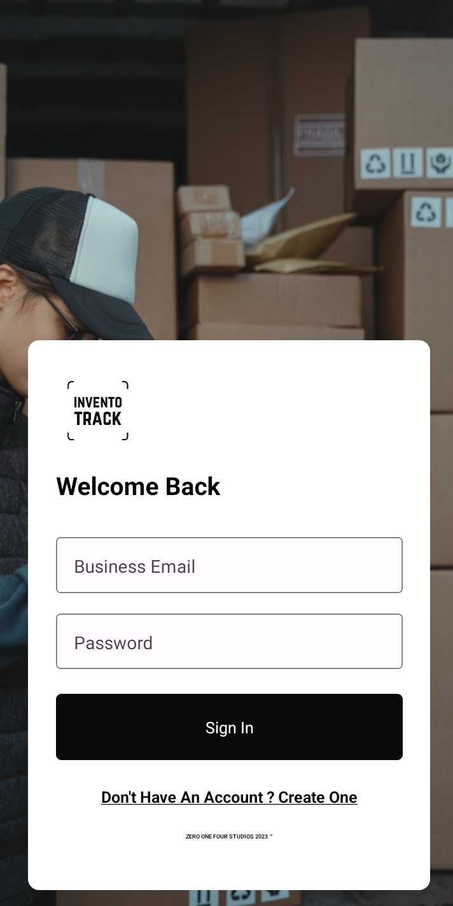
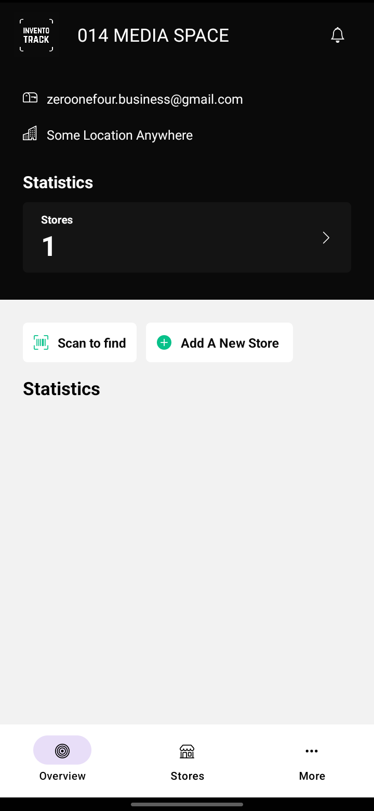
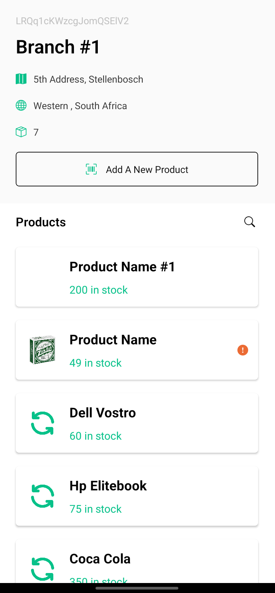
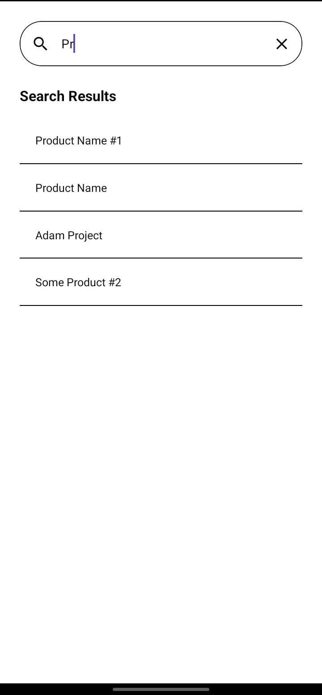
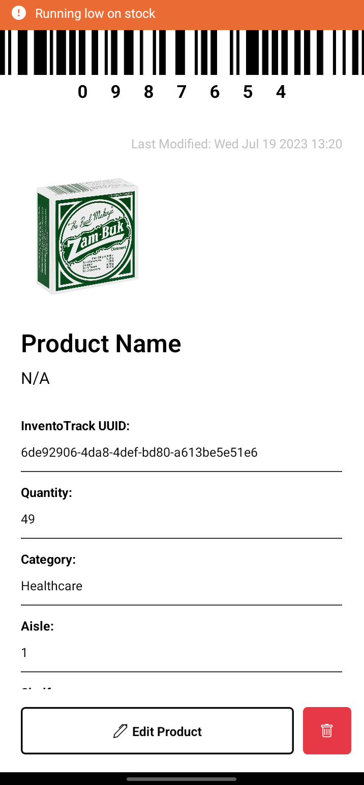

# InventoTrack 📦

ZOFS InventoTrack App is a user-friendly tool designed to help businesses efficiently manage their inventory. Whether you're running a retail store, a warehouse, or any other business that deals with products, this app simplifies the process of tracking and organizing inventory.

 

## Features

- **Intuitive Dashboard**: Get an overview of your inventory at a glance with a user-friendly dashboard.

- **Product Listings**: Add, edit, and delete products with ease. Each listing includes important details such as name, description, quantity, and price.

- **Search and Filtering**: Quickly find products using the search bar or apply filters to narrow down your search.

- **Inventory Alerts**: Set up alerts for low-stock items, ensuring you never run out of popular products.

- **Sales Tracking**: Monitor sales and inventory turnover to make informed restocking decisions.

- **Reports and Analytics**: Generate reports on product sales, restocking frequency, and more. Make data-driven decisions for your business.

- **User Authentication**: Secure your data with user authentication and role-based access control.

 

## Screenshots

### User Authentication 👷‍♂️👷‍♀️

### Overview 📋

### Store Dashboard 📊

### Search and Filtering 📂

### Inventory Alerts ⛔

 

## Built With 🛠
- [React Native](https://reactnative.dev/) -React Native combines the best parts of native development with React, a best-in-class JavaScript library for building user interfaces.
- [React Native Paper](https://reactnativepaper.com) - React Native Paper is a high-quality, standard-compliant Material Design library that has you covered in all major use-cases.
  - [React Native Navigation](https://reactnavigation.org) - Navigation refers to the interactions that allow users to navigate across, into, and back out from the different pieces of content within your app
- [Figma](https://figma.com/) - Figma is a vector graphics editor and prototyping tool which is primarily web-based.

# ZOFS InventoTrack
